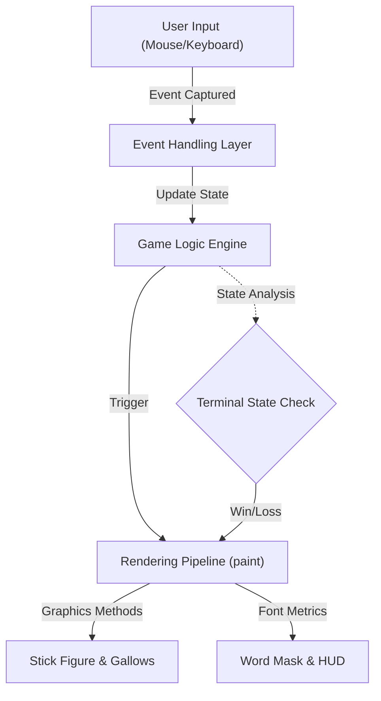

# Technical Specification: HANGMAN-WORD-GAME

## Architectural Overview
The **HANGMAN-WORD-GAME** is implemented as a monolithic Java Applet leveraging the **Abstract Window Toolkit (AWT)** and **Swing** components for graphical rendering and event handling. The implementation adheres to a structured state-based model to manage the game lifecycle.

### Architectural Flow

## 1. Program Structure
The primary executable is defined in `Mega.java`, which inherits from `java.applet.Applet`. The architecture follows a singleton pattern where the main class manages state, logic, and rendering.

### Core Components:
- **Initialization Layer (`init()`)**: Configures the execution environment, instantiates required fonts and color palettes, and establishes the window geometry (1000px x 625px).
- **Control Flow Layer (`newGame()`, `handleInput()`)**: Manages the transitions between pedagogical states (Welcome, Active Play, Outcome).
- **Rendering Pipeline (`paint()`)**: Employs a coordinate-based drawing system using the `Graphics` object to render both static assets and dynamic game elements.

## 2. State Machine Logic
The game operates through a finite set of states determined by boolean flags (`win`, `gameOver`, `hanged`).

| State | Trigger | Rendering Output |
|-------|---------|------------------|
| **Initialization** | Program Execution | Welcome/Intro Screens |
| **Active Play** | User Confirmation | Hidden word mask, gallows base |
| **Verification** | Input Event | Updates `knownChars` or increments `missCount` |
| **Terminal (Win)** | Hidden word completed | Victory message and full gallows restoration |
| **Terminal (Loss)** | `missCount` reaching limit | Final hanging animation and word reveal |

## 3. Rendering Pipeline Specification
The graphical implementation utilizes a custom drawing algorithm within the `paint()` method.

### The Gallows & Stick Figure Algorithm:
The visual complexity of the "Hanging" sequence is directly proportional to the `missCount` variable. Drawing commands are executed sequentially based on the error count:
1. **missCount 1**: Base and vertical beam.
2. **missCount 2**: Horizontal beam and support.
3. **missCount 3-6**: Incremental drawing of the Rope and Head.
4. **Final State**: Full character body and terminal animation.

## 4. Input & Event Handling
The program employs an asynchronous event-handling model using `java.awt.event`:
- **MouseListener**: Manages transitions between screens and UI interactions (e.g., "New Word" button).
- **KeyListener**: Captures alphanumeric input for character guessing. Input is sanitized to ensure case-insensitive comparison against the target `hiddenWord`.

## 5. Data Structures
- **Target Vocabulary**: Managed as a static array of string literals representing programming languages.
- **Character Mapping**: A boolean array `knownChars` tracks the discovery status of each character index in the target string, allowing for partial word masking.

---
*Technical Specification | Computer Engineering Project | Version 1.0*
